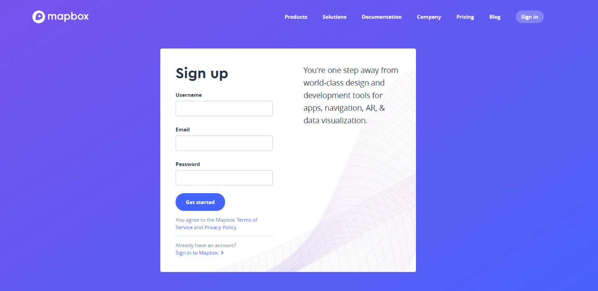
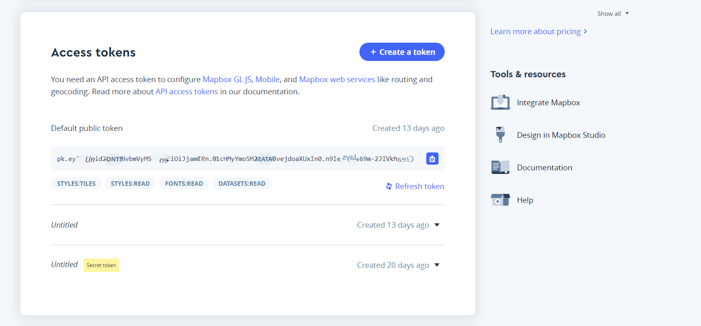

# Contact-Map

## How to set up your own leaflet map and Mapbox Access token.

Firstly, you’ll have to include Leaflet’s CSS and JavaScript files in the head of your document:

```html
<link rel="stylesheet" href="https://unpkg.com/leaflet@1.3.4/dist/leaflet.css"
   integrity="sha512-puBpdR0798OZvTTbP4A8Ix/l+A4dHDD0DGqYW6RQ+9jxkRFclaxxQb/SJAWZfWAkuyeQUytO7+7N4QKrDh+drA=="
   crossorigin=""/>
```
   #### Make sure you place the javascript call AFTER Leaflet's CSS

```html
 <script src="https://unpkg.com/leaflet@1.3.4/dist/leaflet.js"
   integrity="sha512-nMMmRyTVoLYqjP9hrbed9S+FzjZHW5gY1TWCHA5ckwXZBadntCNs8kEqAWdrb9O7rxbCaA4lKTIWjDXZxflOcA=="
   crossorigin=""></script>
```

Now create a div and give it an id:

```html
<div id="yourMapId"></div>
```

After that define a height for your container so it doesn’t take over the page completely:

```css
#yourMapId { height: 180px; }
```

Now it’s time to initialize your map. Here you can set the coordinates and a zoom level for when you open the map. To initialize your map, you’ll need to type this into a separate .js document or just inside script tags on your document.

```javascript
var mymap = L.map('yourMapId').setView([18.46633, -66.105721], 8.2);
```

Now that we have our map initialized, let’s add a layer to it, we’ll go with Mapbox’s Street tile layer. You could create your own tiles and layers but that is out of the scope for this tutorial. This codeblock include a few links and attributes you should know about, we have the URL template (for the tile images), the attribution text (Of course, we need to give credit where credit is due), and the maximum zoom level for the layer.

```javascript
L.tileLayer('https://api.tiles.mapbox.com/v4/{id}/{z}/{x}/{y}.png?access_token={accessToken}', {
    attribution: 'Map data &copy; <a href="https://www.openstreetmap.org/">OpenStreetMap</a> contributors, <a href="https://creativecommons.org/licenses/by-sa/2.0/">CC-BY-SA</a>, Imagery © <a href="https://www.mapbox.com/">Mapbox</a>',
    maxZoom: 18,
    id: 'mapbox.streets',
    accessToken: 'your.mapbox.access.token'
}).addTo(mymap);
```

Right now, after pasting this snippet, you’ll notice the map will not show up, why’s that? Well, for you to be able to access Mapbox’s Maps, Layers or Tiles, you NEED an access token, it’s very easy to get and once you get it all you have to do is paste it in the ‘accessToken’ attribute.

To get an access token, you’ll need to sign up for an account on [Mapbox](https://www.mapbox.com/signup/ "mapbox.com/signup").


 
If you already have a Mapbox account, just go to your account Dashboard and you will see your access tokens.


 

Once all of that is set up you will be able to view your map. Hope this helped.
